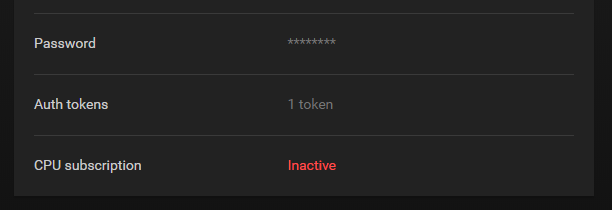
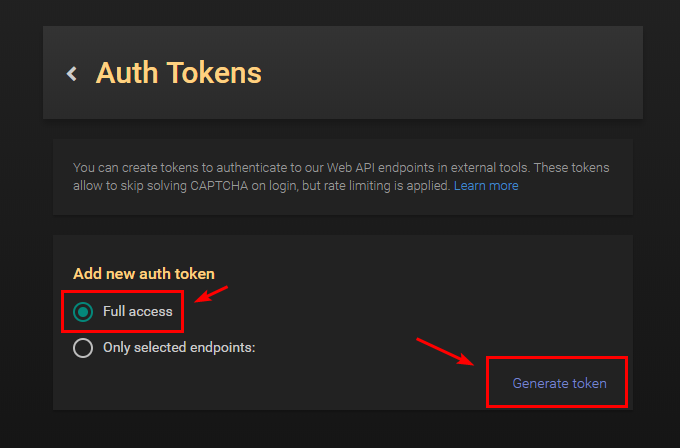
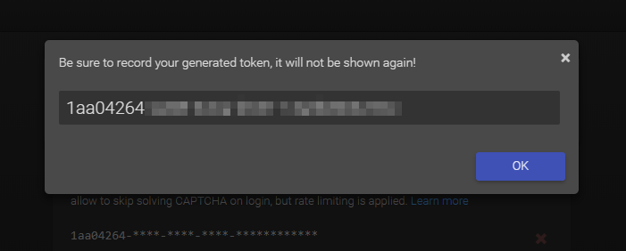
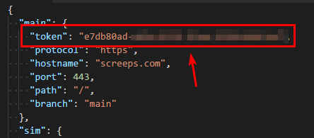

翻译自官方文档：https://github.com/screepers/screeps-typescript-starter/blob/master/docs/getting-started/authenticating.md
# 使用Screeps进行身份验证

Screeps最近引入了 [基于令牌的身份验证系统](http://blog.screeps.com/2017/12/auth-tokens/)，并且旧的身份验证系统将在2018年2月1日被弃用。初学者工具包已经更新以支持这个新的身份验证过程。

## 迁移到新身份验证系统

如果你有一个现有的初学者工具包副本，请遵循以下步骤:

* 从你的 `screeps.json` 文件中移除 `"username"` 和 `"password"` 键，并替换为 `"token"`。
* 升级 `rollup-plugin-screeps` 到版本0.1.1。
* 按照下面定义的身份验证步骤操作。

## 设置Screeps身份验证

身份验证令牌由初学者工具包从名为 `screeps.json` 的文件中提取。项目中提供了一个样本配置文件 `screeps.sample.json` ，要使用它，只需复制并重命名它为 `screeps.json`。

```bash
cp screeps.sample.json screeps.json
```

**重要提示:** The `screeps.json` 文件包含你的Screeps凭证！如果你使用任何源代码控制来存储你的代码库，请不要将此文件提交到你的仓库中。

## 生成身份验证令牌

要生成身份验证令牌，请点击 **\[你的用户名\] &gt; 管理账户**， 现在你应该能在选项中看到 **Auth tokens** ，点击它。



在下一个屏幕上，我们将创建一个全访问令牌。我们选择 **Full access** 选项，然后点击 **Generate Token** 按钮。



生成的令牌现在应该显示在你的屏幕上。将其复制到剪贴板上。



> **注意:** 此令牌只会显示 **一次**! 确保永远不要丢失它。但是，如果你确实丢失了它，只需从你的账户中删除该令牌，然后创建一个新的。

现在，将它粘贴到你的 `screeps.json` 文件中。



## 常规检查

现在我们将做一个快速检查以确认一切是否正常运行。让我们执行一个快速部署。

```bash
npm run push-main
```

现在去你的Screeps客户端并检查主分支 `main` 是否已创建，或者如果该分支已经存在，则代码是否被覆盖。

它工作了吗？很好，你已成功进行了身份验证！

接下来，我们将配置我们的环境并 [运行我们的第一次代码部署](deploying.md)。

