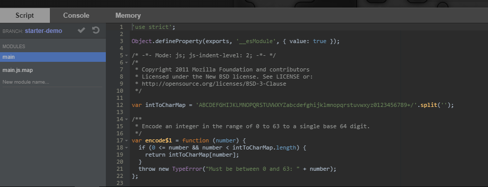

翻译自官方文档：https://github.com/screepers/screeps-typescript-starter/blob/master/docs/getting-started/deploying.md
# 部署

## 构建你的配置文件

初学者工具包使用 `rollup` 构建你的代码，而rollup使用我们在前一节构建的 `screeps.json` 文件作为其配置文件。

`screeps.json` 文件是一个JSON配置文件，分为多个环境。我们将专注于 `main` 环境来开始。
如果你想部署到不同的分支，请确保将 `branch` 键更改为你想要部署到的分支。

提示：
如果目标分支还不存在，你无需手动在Screeps客户端中创建它。 `rollup-plugin-screeps` 会帮你完成。

## 运行你的首次部署

完成后，运行以下命令：

```bash
npm run push-main
```

完成了！现在去你的Screeps客户端并确认你的代码已正确部署。



## 部署到私有服务器

Screeps也允许你运行自己的私有服务器。这可以在一个安全的环境中测试你的代码，而且你可以添加模组来自定义你的服务器，例如大幅提高tick率。

要了解更多关于如何使用或运行你自己的私有服务器的信息，请查看[官方服务器仓库](https://github.com/screeps/screeps)。

要部署到私有服务器，运行以下命令:

```bash
npm run push-pserver
```

如果你在推送代码时遇到问题，请务必检查你的 `screeps.json`。

对于 `"pserver"` ，json属性可能会让人感到困惑:

- `"email"` 实际上应包含你尝试连接的私有服务器上的账号用户名, __这可能与你在官方Screeps分片上的账号不同！__

- `"password"` 需要为该账号在私有服务器上手动设置，[详情见](https://github.com/screeps/screeps#authentication)。

- `"hostname"` 是服务器的IP地址。如果你在本地托管服务器，大多数网络的默认本地主机IP是 `127.0.0.1`。

[//]: # (准备好挑战更多？继续 [阅读]&#40;./module-bundling.md&#41;。)

